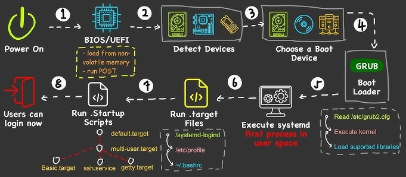

## Concept of Booting

### What is Booting?
Booting is the process of starting a computer and loading the operating system (OS) into the main memory so that the computer becomes ready to execute user commands. When a computer is first powered on, the CPU has no instructions in memory, so it needs to load the OS to initiate functionality.

### Types of Booting
There are two primary types of booting:

#### 1. Cold Booting
Cold booting, also known as a hard boot, occurs when the computer is started from an off state. When you press the power button, the system reads instructions from the ROM (Read-Only Memory) and loads the operating system into the main memory. This is the typical process when you first start your computer.

#### 2. Warm Booting
Warm booting, or soft booting, happens when the computer is restarted without being turned off. This is often done when the system becomes unresponsive or when certain updates require a restart. During a warm boot, the system bypasses the initial hardware checks and simply reloads the operating system. This can be triggered by pressing the restart button or using a key combination like `CTRL + ALT + DELETE`.

### Steps of the Booting Process
The booting process can be broken down into six major steps:

#### **Step 1: BIOS and Setup Program**
- **BIOS (Basic Input/Output System):** This is a set of essential software instructions stored in the ROM (Read-Only Memory) of the computer. BIOS initializes and tests the system's hardware components and loads the bootloader or the OS into the computer's memory.
- **ROM:** A non-volatile memory that stores the BIOS firmware, which is permanent and unchanging.
- **Setup Program:** This is a special program that allows you to configure hardware settings. It can only be accessed during the initial boot phase when BIOS is running.

#### **Step 2: Power-On Self-Test (POST)**
- **POST (Power-On Self-Test):** During POST, the BIOS conducts a series of tests on the computer’s hardware components such as memory, input/output devices, disk drives, and the hard disk to ensure they are functioning correctly.
- If any issues are detected, the system may emit beeping sounds or display error messages on the monitor.

#### **Step 3: Loading the Operating System (OS)**
- After a successful POST, the BIOS searches for the operating system. It checks the settings in the CMOS (Complementary Metal-Oxide-Semiconductor) to determine where to locate the OS.
- The OS kernel, which is the core part of the operating system, is then loaded into memory. The kernel takes control of the computer and starts loading system configuration information.

#### **Step 4: System Configuration**
- **Registry:** The OS’s registry is a database that stores information about the system’s hardware, software, and configuration settings.
- **Peripherals:** Devices connected to the computer, such as a mouse, keyboard, or printer.
- **Drivers:** Utility programs that enable the operating system to communicate with peripheral devices.
- During this step, the OS loads drivers and other configuration settings from the registry into memory.

#### **Step 5: System Utilities Load**
- System utilities are background programs that are loaded into memory to manage system resources and provide essential services.
- Examples include:
  - Volume control utilities
  - Antivirus software
  - Safely remove hardware utilities (e.g., PC card unplugging utility)

#### **Step 6: User Authentication**
- **Authentication:** The process where the user is required to log in with a username and password.
- After successful authentication, the user interface (UI) is loaded, allowing the user to interact with the computer and access programs and applications.

At the end of these steps, the computer is fully booted and ready for use.
